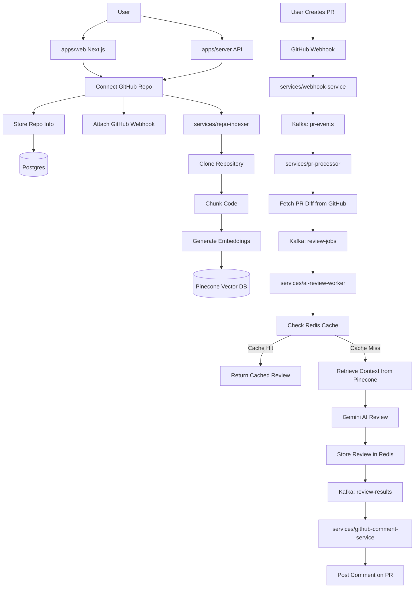

# AI Code Review System

A monorepo for automated code review using AI.

## What's inside?

### Apps and Packages

- `apps/web`: a [Next.js](https://nextjs.org/) app
- `apps/server`: a Node.js API server
- `packages/ai`: AI utilities shared across services
- `packages/config`: shared configuration
- `packages/db`: Prisma database client
- `packages/kafka`: Kafka utilities
- `packages/logger`: logging utility shared across services
- `packages/redis`: Redis client
- `packages/types`: shared TypeScript types
- `services/ai-review-worker`: AI review worker service
- `services/github-comment-service`: GitHub comment service
- `services/pr-processor`: PR processor service
- `services/repo-indexer`: Repository indexing service
- `services/webhook-service`: Webhook service

Each package/app is 100% [TypeScript](https://www.typescriptlang.org/).

### Utilities

- [TypeScript](https://www.typescriptlang.org/) for static type checking
- [ESLint](https://eslint.org/) for code linting
- [Prettier](https://prettier.io) for code formatting
- [Turborepo](https://turbo.build/) for build orchestration

### Build

To build all apps and packages, run the following command:

```sh
pnpm build
```

### Develop

To develop all apps and packages, run the following command:

```sh
pnpm dev
```

You can develop a specific package by using a filter:

```sh
pnpm dev --filter=web
pnpm dev --filter=ai-review-worker
```


