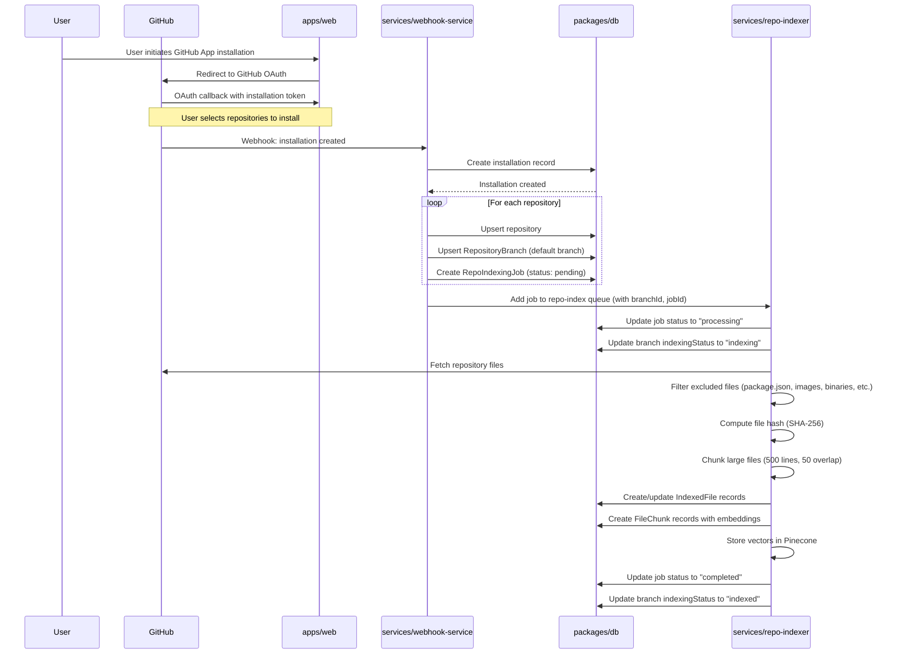
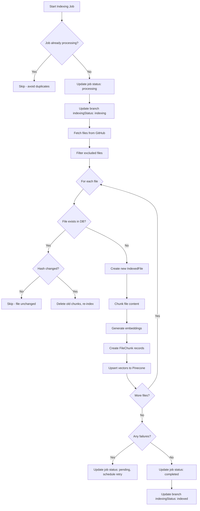
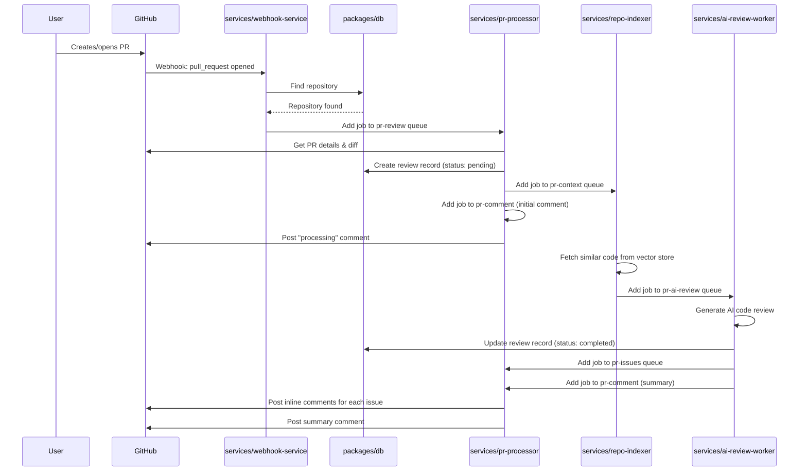

# AI Code Review System

A monorepo for automated code review using AI.

## Data Flows

### 1. When a User Installs the Bot to a Repository



### 2. Repository Indexing Flow (Detailed)



### 3. When a User Raises a Pull Request



## Indexing Features

### File Filtering
The repo-indexer automatically excludes:
- **Package files**: `package.json`, `package-lock.json`, `yarn.lock`, `pnpm-lock.yaml`
- **Binary assets**: Images (`.png`, `.jpg`, `.gif`, `.svg`, `.webp`), Videos, PDFs
- **Build artifacts**: `node_modules`, `dist`, `build`, `.next`, `.nuxt`
- **Minified files**: `.min.js`, `.min.css`, `.map`
- **System files**: `.DS_Store`, `Thumbs.db`

### Chunking Strategy
- **Chunk size**: 500 lines
- **Overlap**: 50 lines (for context continuity)
- Each chunk gets its own embedding stored in `FileChunk` table

### Retry Mechanism
- **Retryable errors**: Rate limits, quota exceeded
- **Max retries**: 3
- **Backoff**: Exponential (60s, 120s, 240s)
- Failed jobs are marked as `pending` and retried automatically

### Diff-Based Indexing (Production Optimization)
The system uses intelligent diff-based indexing to avoid full re-indexing:

**Branch Create Event:**
- If base branch is indexed → mark new branch as indexed (no job)
- If base branch not indexed → trigger full indexing

**Push Event:**
- Compare `before` (old commit SHA) vs `after` (new commit SHA)
- If identical → skip indexing
- If different → create diff-based job with baseCommitSha + headCommitSha

**Worker Logic:**
- Uses GitHub Compare API: `GET /repos/{owner}/{repo}/compare/{base}...{head}`
- Only fetch changed files (added, modified, removed)
- Skip unchanged files via hash comparison
- Delete removed files from index

**Edge Cases Handled:**
- Force push → fallback to full indexing
- First commit (no base) → fallback to full indexing
- Large diff (500+ files) → fallback to full indexing

## What's inside?

### Apps and Packages

- `apps/web`: a [Next.js](https://nextjs.org/) app
- `apps/server`: a Node.js API server
- `packages/ai`: AI utilities shared across services
- `packages/config`: shared configuration
- `packages/db`: Prisma database client
- `packages/kafka`: Kafka utilities
- `packages/logger`: logging utility shared across services
- `packages/redis`: Redis client
- `packages/types`: shared TypeScript types
- `services/ai-review-worker`: AI review worker service
- `services/pr-processor`: PR processor and GitHub comment service
- `services/repo-indexer`: Repository indexing service
- `services/webhook-service`: Webhook service

Each package/app is 100% [TypeScript](https://www.typescriptlang.org/).

### Utilities

- [TypeScript](https://www.typescriptlang.org/) for static type checking
- [ESLint](https://eslint.org/) for code linting
- [Prettier](https://prettier.io) for code formatting
- [Turborepo](https://turbo.build/) for build orchestration

### Build

To build all apps and packages, run the following command:

```sh
pnpm build
```

### Develop

To develop all apps and packages, run the following command:

```sh
pnpm dev
```

You can develop a specific package by using a filter:

```sh
pnpm dev --filter=web
pnpm dev --filter=ai-review-worker
```

## Roadmap - Feature Parity with CodeRabbit

### Already Implemented ✅
- PR webhook handling
- Repository indexing with Pinecone vector store
- AI code review generation (Gemini)
- Inline comments + summary with walkthrough, sequence diagrams, poem
- GitHub Check Run integration
- Real-time streaming (SSE)
- Dashboard with review history
- Repository management page

### Todo List - Missing Features

- [ ] **Chat/Conversation** - Chat interface for follow-up questions about code
- [ ] **Auto-PR description** - Automatically generate PR descriptions
- [ ] **Custom review rules** - Configurable rules (security, performance, best practices)
- [ ] **Accept/Reject UI** - Dashboard to accept AI suggestions directly
- [ ] **Security-specific scanning** - Dedicated vulnerability detection
- [ ] **Test generation** - Suggest or generate tests
- [ ] **Code explanation** - Ask for explanations of specific code sections
- [ ] **Review automation rules** - Configure when to auto-review (labels, paths, authors)
- [ ] **Team/Organization management** - Multi-tenant support
- [ ] **Billing/Subscription** - Monetization features
- [ ] **API for external access** - Programmatic integrations
- [ ] **Review analytics** - Statistics on review patterns
- [ ] **File deep-dive view** - Detailed per-file review UI in dashboard
- [ ] **Commit-level analysis** - Analyze individual commits (beyond just PRs)
- [ ] **Notification preferences** - Granular alert settings
